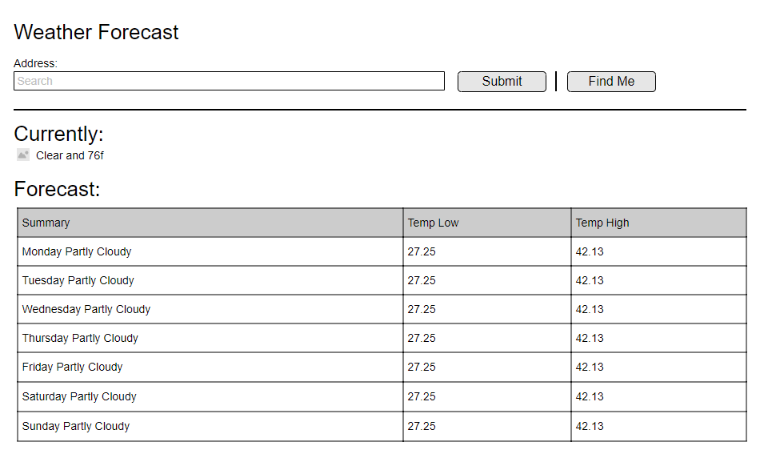

# Weather Api Test
https://www.geocod.io for Geocoding

https://darksky.net/dev for weather forcast

https://cors-anywhere.herokuapp.com/ is required to bypass cors issue with darksky

## Project setup
```
npm install
```

Create API keys at `https://www.geocod.io` and `https://darksky.net/dev` and update the `.env` file.

Create a SPA based on the 

### Compiles and hot-reloads for development
```
npm run serve
```

### Compiles and minifies for production
```
npm run build
```
